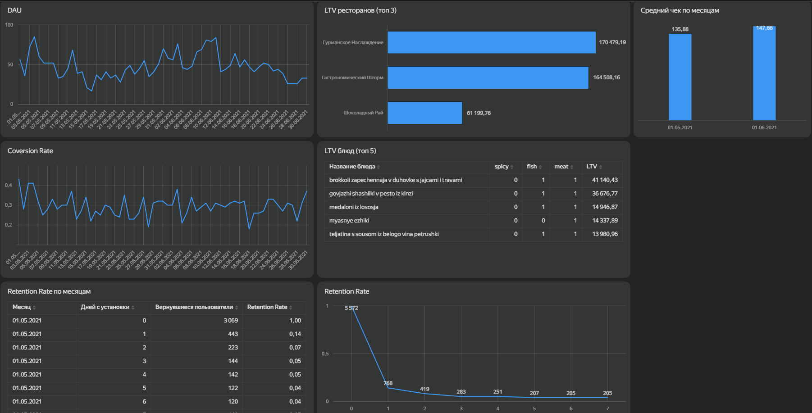

# Анализ ключевых бизнес-метрик сервиса доставки еды (SQL + Yandex DataLens)

## Бизнес-задача
Проанализировать ключевые продуктовые метрики сервиса доставки еды «Всё.из.кафе» (г. Саранск) за период с 1 мая по 30 июня 2021 года. Необходимо выявить точки роста, причины оттока и сформировать рекомендации для маркетинга и продукта.

## Стек технологий
* **Извлечение данных:** SQL (скрипты для расчета метрик)
* **Визуализация:** Yandex DataLens (построение дашборда)
* **Метрики:** DAU, CR, Средний чек, Retention Rate, LTV

## Интерактивный дашборд

## Аналитические инсайты
* **DAU (Активность аудитории):** Наблюдается сильная зависимость от дня недели. Пики приходятся на рабочие дни (особенно Пн-Ср и Пт), в выходные посещаемость падает в 1.5-2 раза. Основные пользователи сервиса - офисные работники, заказывающие бизнес-ланчи.
* **Conversion Rate (Конверсия):** Метрика волатильна (от 18% до 43%). Пик конверсии зафиксирован на майских праздниках и в конце июня. Несмотря на падение трафика, приходящая аудитория максимально лояльна. Резкие просадки требуют проверки технической части сервиса.
* **Средний чек:** В июне рост количества заказов составил 5%, а средний чек вырос на 8.7% (до 147.66 руб). Пользователи начали чаще делать объемные заказы на компании.
* **Retention Rate (Удержание):** Критический отток происходит в первые сутки - на 1-й день возвращается только 14% аудитории. К 7-му дню метрика стабилизируется на уровне 4%. Когортный анализ показывает ухудшение удержания новых пользователей со временем.
* **LTV и Рестораны:** Основную выручку создают заведения с сытными позициями («Гурманское наслаждение» - 170k руб, «Гастрономический шторм» - 164k руб). Кондитерские отстают почти в 3 раза. В топ-5 блюд по LTV доминируют мясные и рыбные позиции (запеченная брокколи, говяжьи шашлыки). Острые блюда не приносят значимого LTV.

## Итоговые рекомендации для бизнеса
1. Внедрить приветственный бонус на 1-2 дни после установки, чтобы смягчить потерю 86% пользователей в первые сутки.
2. Настроить автоматическую рассылку промокодов на повторный заказ в течение 3-5 дней после первой покупки.
3. Полностью исключить из рекламы острые блюда. Перераспределить бюджет на сытные мясные и рыбные позиции.
4. Ввести выгодные комбо-наборы и специальные push-уведомления по выходным дням.
5. Добавить алгоритм рекомендаций дополнительных товаров на этапе корзины.
