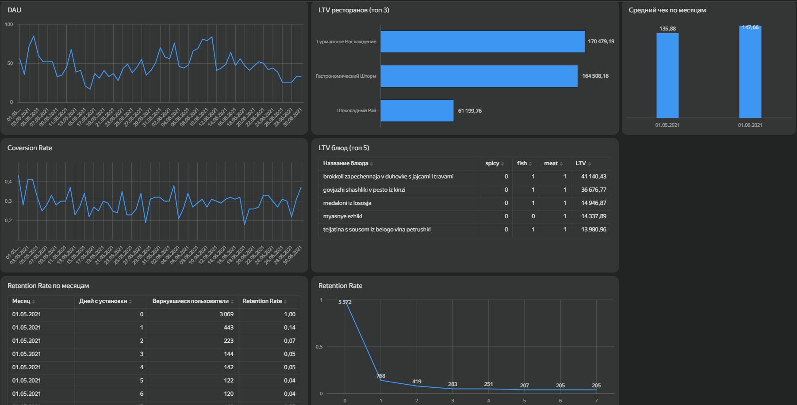

# Анализ ключевых метрик сервиса доставки еды

## О проекте
Анализ продуктовых метрик сервиса доставки еды «Всё.из.кафе» (Саранск) за период с 1 мая по 30 июня 2021 года.

**Цель:** найти точки роста, причины оттока и дать рекомендации для маркетинга и продукта.

## Стек
- SQL — расчёт метрик
- Yandex DataLens — дашборд

## Дашборд
Дашборд состоит из двух вкладок: визуализация метрик и аналитическая записка с выводами.

[ОТКРЫТЬ ДАШБОРД](https://datalens.yandex/tg62u18bx1hwc)

## Главные выводы

**DAU**
- Сильная зависимость от дня недели. Пики в рабочие дни (особенно Пн–Ср и Пт), в выходные падение в 1.5–2 раза.
- Основная аудитория — офисные работники, которые заказывают бизнес-ланчи.

**Conversion Rate**
- Метрика волатильна (18-43%).
- Пики на майских праздниках и в конце июня.
- Даже при падении трафика приходящая аудитория довольно лояльна.
- Резкие просадки стоит проверить с технической стороны.

**Средний чек**
- В июне количество заказов выросло на 5%, средний чек — на 8.7% (до 147.66 руб.).
- Пользователи стали чаще делать более объёмные заказы.

**Retention Rate**
- Критический отток в первые сутки: на 1-й день возвращается только 14%.
- К 7-му дню метрика стабилизируется на уровне ~4%.
- Удержание новых когорт со временем ухудшается.

**LTV**
- Основную выручку дают заведения с сытными позициями («Гурманское Наслаждение» — 170k, «Гастрономический Шторм» — 164k).
- Кондитерские отстают почти в 3 раза.
- В топ-5 блюд по LTV — мясные и рыбные позиции. Острые блюда почти не приносят LTV.

## Рекомендации
1. Добавить приветственный бонус на 1-2 день после установки, чтобы снизить отток 86% пользователей в первые сутки.
2. Настроить автоматическую рассылку промокодов на повторный заказ через 3-5 дней.
3. Убрать острые блюда из рекламы. Перенаправить бюджет на мясные и рыбные позиции.
4. Запускать комбо-наборы и push-уведомления по выходным.
5. Добавить рекомендации дополнительных товаров на этапе корзины.

## Структура репозитория
- `dashboard.png` - скриншот дашборда

## Как запустить
Откройте дашборд в Yandex DataLens.
